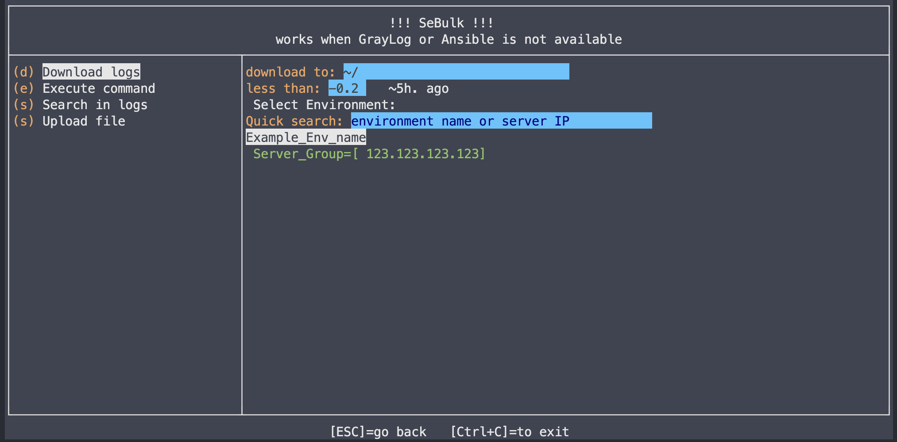
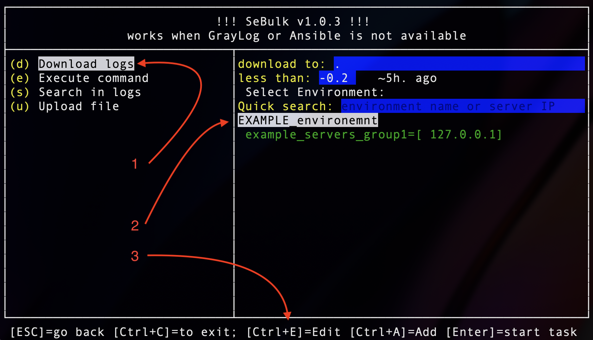
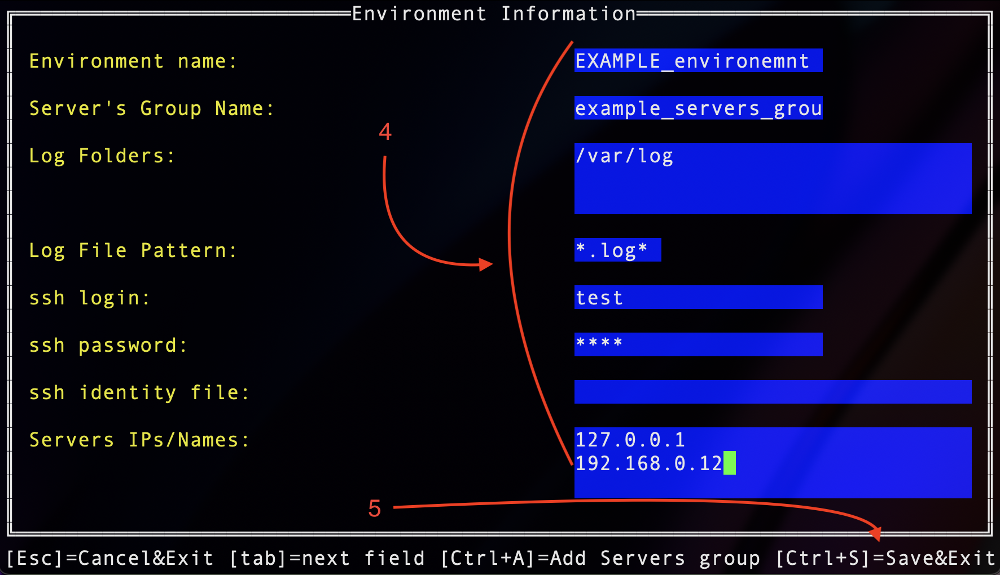

- [SeBulk](#sebulk)
  - [Motivation and introduction](#motivation-and-introduction)
  - [Functionality overview](#functionality-overview)
    - [Different methods to use SeBulk](#different-methods-to-use-sebulk)
  - [Execute with UI](#execute-with-ui)
    - [Create config file from UI mode](#create-config-file-from-ui-mode)
  - [Execute via CLI](#execute-via-cli)
    - [to execute command](#to-execute-command)
    - [for search](#for-search)
    - [for logs download](#for-logs-download)
    - [upload file to servers](#upload-file-to-servers)
  - [Config file examples](#config-file-examples)
    - [If connection should be performed via Bastion server](#if-connection-should-be-performed-via-bastion-server)
      - [Bastion (Jump) server password authentication is used](#bastion-jump-server-password-authentication-is-used)
      - [Bastion (Jump) server Public/Private Key File authentication is used](#bastion-jump-server-publicprivate-key-file-authentication-is-used)
    - [Config without Bastion (Jump) server](#config-without-bastion-jump-server)
  - [Build](#build)
    - [Cross platform: Build for Linux](#cross-platform-build-for-linux)
    - [Cross platform: Build for Windows](#cross-platform-build-for-windows)
  - [Testing](#testing)
    - [Debug](#debug)
- [QA](#qa)


# SeBulk
## Motivation and introduction
Usually, in production or prodlike environments, we can face with multi-nodes servers, and it's time consuming task to check logs in such environments. Even downloading of the log files from such environment requires huge amount of time. To help with the task `SeBolk` utility was developed.

Alternative solution is GrayLog (https://www.graylog.org), which is used to capture, store, and real-time search and log analysis. However Graylog may not be available due to particular reasons, for example: it may not be configured for environment, the server with Graylog is failed, or indexing in Graylog can be broken(for example due to incorrect configuration of feeder utilities). 

`SeBulk` works with SSH connection and uses native Linux commands like: `find`, `tar`, `grep`, `awk` to find newest logs, compress them and download into local machine. 

Also `SeBulk` can be helpful for QA engineers, in case if some error is reproduced, it's required to attach logs of the error. However, it may not be enough just to attach one file with error. In this case `SeBulk` functionality perfectly satisfies the task: `SeBulk` will download all log files from the server, which are not alder than _XX_ specified number of hours.

## Functionality overview 
The `SeBulk` allows to 
- quick search in the logs of different nodes and servers (for example in case if `GrayLog` is not available for the environment)
- download all logs (in case if you need to attach logs from all server to ticket for DEV team)
- upload file (if you have hotfix which should be uploaded to all nodes / servers)
- and execute commands on the servers simultaneously (for example in case if `Ansible` is not available)

### Different methods to use SeBulk 
`SeBulk` can be executed in console (terminal, cli, shell), for example if you need automated execution of the application, for example: 
```
./sebulk -s "\[ERROR" -no-ui > ~/Downloads/output.txt
```
(see more details in the sections below)

Alternatively you can use Textual UI:

The UI is designed to be user friendly, additional key combinations are displayed in the bottom portion of the screen.
Anyway if you have recommendations about UI improvements (or improvement of any other functionality) - please contact me.

## Execute with UI
By default application is executed with textual UI.
It can be executed in the same way as all other applications: with double click on executable file or from terminal without parameters.

`SeBulk` uses config file with environment and servers, to connect to the server via SSH and execute commands on the servers.  
However, when `SeBulk` is executed in UI mode it generates _demo_ environment.

### Create config file from UI mode
Default config file can be geenrated using the executable.
Run `SeBulk`.
1. Select convinuent option in the left-side list, for example: `Download logs`

1. Press arrow keys / or tab / or enter (or just click on environment name on the right-side list, for example `EXAMPLE_environment`)
2. Press Ctrl+E keys on keyboard

4. Populate parameters like IP address(the field allows multiple server IPs separated by end of line), ssh credentials and etc. :exclamation: NOTE: the credentials will be stored as plain text in JSON config file, so it's recomended to use `ssh identity file` (SSH private key file in OpenSSH format, see more details in: https://www.openssh.com/).
5. Press Ctrl+S to save changes (in this case file `sebulk_config.json` will be generated), see example content of the file brlow:
```json
{
    "DownloadFolder": ".",
    "UploadFolder": "/var/tmp",
    "LogsMtime": -0.2,
    "Environments": [
        {
            "Name": "EXAMPLE_environemnt",
            "DoNotSave": false,
            "Servers": [
                {
                    "Name": "example_servers_group1",
                    "LogFolders": [
                        "/var/log"
                    ],
                    "LogFilePattern": "*.log*",
                    "Login": "test",
                    "Passowrd": "test",
                    "IdentityFile": "",
                    "BastionServer": "",
                    "BastionLogin": "",
                    "BastionIdentityFile": "",
                    "BastionPassword": "",
                    "IpAddresses": [
                        "127.0.0.1",
                        "192.168.0.12"
                    ]
                }
            ]
        }
    ]
}
```
Them you can modify the file directly to create additional environments.
:exclamation: NOTE: `sebulk_config.json` file format is different that the format of the files which are user in command-line mode, because CLI mode works for particular and UI mode allows to select from the list of environments.

## Execute via CLI
### to execute command
```
 .\sebulk.exe -c .\win_sebulk_config_PPT.json --servers SERVER_GROUP_NAME -e "ls -l /var/tmp"
```
### for search
```
./sebulk -s "\[ERROR" -no-ui > ~/Downloads/output.txt
```
### for logs download
```
./sebulk --servers SERVER_GROUP_NAME -c ./config/sebulk_config_SVT.json  -d ~/Downloads
```

### upload file to servers
```
./sebulk -c ./config/sebulk_config_SVT.json  -u ~/Downloads/file_to_upload.txt
```
__NOTE:__ the file will be uploaded to /var/tmp folder (if folder does not exist uploading will fail for the server)


## Config file examples
### If connection should be performed via Bastion server
#### Bastion (Jump) server password authentication is used
```yaml
{
    "servers": [
        {
            "name": "SERVER_GROUP_NAME",
            "description": "",
            "logFolders": ["/var/tmp/logs"],
            "logFilePattern": "*.log*",
            "BastionServer": "192.XXX.XXX.1",
            "BastionLogin": "YourLoginforBastion",
            "BastionPassword": "YourPasswordforBastion",
            "login": "YourLoginToTheServerGroup",
            "passowrd": "YourLoginToTheServerGroup",
            "ipAddresses": [
                "172.XXX.XXX.XX1",
                "172.XXX.XXX.XX2"
            ]
        }
    ]
}
```

#### Bastion (Jump) server Public/Private Key File authentication is used
```yaml
{
    "servers": [
        {
            "name": "SERVER_GROUP_NAME",
            "description": "",
            "logFolders": ["/var/tmp/logs"],
            "logFilePattern": "*.log",
            "BastionServer": "192.XXX.XXX.1",
            "BastionLogin": "YourLoginforBastion",
            "BastionIdentityFile": "/Users/username/.ssh/key_rsa",
            "login": "YourLoginToTheServerGroup",
            "passowrd": "YourLoginToTheServerGroup",
            "ipAddresses": [
                "172.XXX.XXX.XX1",
                "172.XXX.XXX.XX2"
            ]
        }
    ]
}
```
### Config without Bastion (Jump) server
```yaml
{
    "servers": [
        {
            "name": "SERVER_GROUP_NAME",
            "description": "",
            "logFolders": ["/var/tmp/logs"],
            "logFilePattern": "*.log",
            "login": "YourLoginToTheServerGroup",
            "passowrd": "YourLoginToTheServerGroup",
            "ipAddresses": [
                "172.XXX.XXX.XX1",
                "172.XXX.XXX.XX2"
            ]
        }
    ]
}
```

## Build

if your you're building in the same platform you can use simple:
```sh
go build -o ./build .
```
for cross platform building you can use:
```sh
env GOOS=target-OS GOARCH=target-architecture go build 
```
more details in: https://www.digitalocean.com/community/tutorials/how-to-build-go-executables-for-multiple-platforms-on-ubuntu-16-04


### Cross platform: Build for Linux
```sh
env GOOS=linux GOARCH=amd64 go build -o ./build .
```
### Cross platform: Build for Windows
```sh
env GOOS=windows GOARCH=386 go build -o ./build/sebulk.exe .
env GOOS=windows GOARCH=amd64 go build -o ./build/sebulk.exe .
```

## Testing 
```ssh
docker build -t sebulk_test .
docker run -d -p 22:22 sebulk_test
```
https://dev.to/s1ntaxe770r/how-to-setup-ssh-within-a-docker-container-i5i

or just execute:
```
./test.sh
```

### Debug
```
go build -gcflags=all="-N -l" -o ./test .
```
execute ./sebulk 
update "processId" in .vscode/launch.json file 

use ">" in Run and Debug

# QA
1. What is Bastion server? 
Answer: see more information in: https://goteleport.com/blog/ssh-bastion-host/

